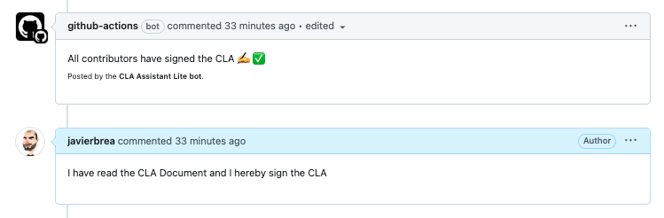

# Open Source Project Template

## Description

This repository is a template for creating open source projects. It is mainly focused on providing __files related to the licensing, contribution, and code of conduct__ of the project, as wel as __tools to automate the process of signing the Contributor License Agreement (CLA)__ and instructions to setup other automatic processes, such as the __check of the licensing of the dependencies.__

## Table of Contents

* [Preface](#preface)
* [What's included?](#whats-included)
* [Instructions](#instructions)
* [Automatic Contributing License Agreement](#automatic-contributing-license-agreement)
* [License Compliance check](#license-compliance-check)

## Preface

Before creating a new open source project, you should read the [Practical Guide to Open Source Software at Telefónica](https://telefonicacorp.sharepoint.com/:w:/s/PatentOffice.TMEHI/EV1Yvq2kUhhCgy5FG-lryaYBWLwIRewSMZXsbZJeQ5uhlg?e=Mdrdwh&wdLOR=cCBDCEA92-4CAC-CF4A-BF60-44FC3F909578).

> [!WARNING]
> The procedure explained in this repository is not a replacement for that document, it is just a template to help you to setup the repository before publishing it.

## What's included?

This template includes the following:

* [__Readme file__](./README.project.md): The main README file of the project. It should be renamed to `README.md` and replace this one before publishing the project. It includes:
  * A template for the title, description, and table of contents of the project.
  * Link to the Contributing Guidelines
  * Link to the License file, and to the Mozilla Public License 2.0 FAQ.
* [__License file__](./LICENSE): The license file of the project. By default, it is the Mozilla Public License 2.0, but it can be changed to any other license compliant with the Telefónica's open source policies.
* [__Code of conduct__](./.github/CODE_OF_CONDUCT.md): The code of conduct of the project. By default, it is the Contributor Covenant published at [contributor-covenant.org](https://www.contributor-covenant.org/).
* [__Contributing guidelines template__](./.github/CONTRIBUTING.md): The contributing guidelines of the project. It includes:
  * A link to the License file.
  * License headers that must be included in new files. Based on the [instructions of the Software Package Data Exchange (SPDX) website](https://spdx.dev/) (this should be updated to match the license of the project).
  * A link to the Code of Conduct.
  * A human-readable summary of the Contributor License Agreement, and links to the full CLA.
* [__Contributor license agreement__](./.github/CLA.md): The Contributor License Agreement of the project.
  * It is based on the [CLA of HashiCorp](https://cla.hashicorp.com/).
* [__Workflow checking license integrity__](#license-integrity-check): A Github Action that checks that all files in the project are rightly licensed. That is, it checks that all files have the expected license header.
* [__Instructions to check License Compliance of dependencies__](#license-compliance-check): It includes instructions to check the licensing of the dependencies of the project in different languages. It also includes an example of a [tool for checking Node.js dependencies](./tools/nodejs/license-compliance/README.md), that, indeed, is checking the licensing of the dependencies in this repository.
* [__Pull Request template__](./.github/PULL_REQUEST_TEMPLATE.md): The pull request template of the project. It includes:
  * A template for the title and description of the pull request.
  * A checklist to ensure that the contributor has read and understood the CONTRIBUTING and CODE_OF_CONDUCT documents, that the contribution is made under the terms of the License, and that the contributor accepts the storage of their Github user name for the purpose of future reference.
  * A reminder to sign the CLA through a comment in the PR.
* __Issue templates__: Templates for bug reports and feature requests. The user is enforced to use one of the provided templates. Creating new issues without using a template is not allowed. The templates are:
  * [__Bug report__](./.github/ISSUE_TEMPLATE/bug_report.md): A template for bug reports.
    * Includes a check to ensure that the contributor has read the Code of Conduct.
  * [__Feature request__](./.github/ISSUE_TEMPLATE/feature_request.md): A template for feature requests.
    * Includes a check to ensure that the contributor has read the Code of Conduct.

## Instructions

1. __Create a new repository__: Click on the "Use this template" button in Github when creating a new repository, and select this template.
2. __Update the README file__: Clone the repository and replace the content of the `README.md` file with the content of the `README.project.md` file.
3. __Delete unused files__: Delete the `README.project.md` file and the `docs/assets` folder, which is only used to store the images of this README file.
  * If you are not going to use Node.js in your project, you can also delete the next files and folders: `package.json`, `package-lock.json`, `cspell.config.json` `eslint.config.js`, `jsconfig.json`, `.husky` and the `tools/nodejs` folder.
4. __Replace placeholders__: Search and replace the nex placeholders in every file by the corresponding values:
    * `{{ project_name }}`: The name of the project.
    * `{{ project_description }}`: The description of the project.
    * `{{ company }}`: The name of the company or organization that owns the project (usually Telefónica).
    * `{{ repo_url }}`: The URL of the repository.
    * `{{ email }}`: The email of the person at charge of the Code of Conduct enforcement.
    * `{{ year }}`: The year when the project was created. Used as an example in the license headers.
5. __Update the license__: If the project uses a different license than the Mozilla Public License 2.0:
    * Replace the content of the `LICENSE` file with the content of the new license.
    * Review the content of the `CONTRIBUTING.md` file to ensure that the license headers match the new license.
    * Change the link to the License FAQ in the `README.md` file to the corresponding FAQ of the new license.
6. __Add the Contributing Guidelines__: Customize the `CONTRIBUTING.md` file to match the contribution guidelines of the project. You should __fill the "Getting Started" section__ with the steps that a contributor should follow to start contributing to the project, and __add as many sections as needed to explain the contribution process__. But you should __always keep the rest of sections__ about the licensing of new files, code of conduct and the CLA.
7. __Fill the README file__: Fill the `README.md` file with the sections that describe the project, how to install it, how to use it, etc. But __always keep the "Contributing" and "License" sections__.
8. __Customize the Issue templates__: Add or remove sections from the issue templates to match the needs of the project, but __always keep the checks to ensure that the contributor has read the Code of Conduct__.
9. __Setup the check License Compliance workflow__: Every open source project must include an automatic job to check the licensing of the dependencies. Read the [chapter below](#license-compliance-check) to know how to setup this workflow for different languages. You can use the `.github/workflows/license-compliance-node.yml` file as an example, and adapt it to the language of your project. In case you use more than one language, you can create a different workflow for each one.
10. __Configure the License Integrity check__: The repository includes a workflow that checks that all files in the project are rightly licensed. Read the [chapter below](#license-integrity-check) to know how to setup this workflow properly.
11. __Configure the automatic CLA__: The repository includes a workflow that automates the process of signing the CLA. Read the [chapter below](#automatic-contributing-license-agreement) to know how to setup this workflow properly.
12. __Configure the repository__: Protect the main branch, and configure the branch protection rules to ensure that the checks of the pull requests pass before merging them.
13. __Publish the project__: Once the repository is ready, ask to your manager to contact with the legal department to review the project and approve the publication.

## Automatic Contributing License Agreement

The Contributor License Agreement (CLA) is a legal document that defines the terms under which a contributor is allowed to contribute to the project. It is a common practice in open source projects to ensure that the project owner has the necessary rights to distribute the contributions.

This repository includes a workflow that automates the process of signing the CLA. The workflow uses the [lite version](https://github.com/contributor-assistant/github-action) of the [CLA Assistant](https://github.com/cla-assistant/cla-assistant) tool, which is a free service that integrates with Github to manage the CLA process.


In this case, the signing of the CLA is done through a comment in the pull request. CLA workflow creates a comment on Pull Request asking contributors who have not signed CLA to sign and also fails the pull request status check with a failure. The contributors are requested to sign the CLA within the pull request by copy and pasting "I have read the CLA Document and I hereby sign the CLA" as a Pull Request comment like below. If the contributor has already signed the CLA, then the PR status will pass with success. The data of the contributors signing the CLA will be stored in a branch of the same repository.



To setup the automatic CLA, follow these steps:

* Edit the [`.github/workflows/contributor-license-agreement.yml`](./.github/workflows/contributor-license-agreement.yml) file and change the following values:
  * Change the url of the repository.
  * If desired, change the branch where the data of the contributors signing the CLA will be stored.
* Configure the branch protection rules to require the CLA to be signed before merging the pull requests.
* Remember to protect against deletion the branch where the data of the contributors signing the CLA will be stored.

## License Integrity check

This repository includes a Github Action that checks that all files in the project are rightly licensed. That is, it checks that all files have the expected license header.

You can find the workflow in the [`.github/workflows/license-integrity.yml`](./.github/workflows/license-integrity.yml) file.

To setup the license integrity check, edit the [`.github/license-headers/config.json`](./.github/license-headers/config.json) file according to the files in your project, following the [instructions of the License Checker Github action](https://github.com/viperproject/check-license-header).

> [!WARNING]
> The header configuration files should be defined according to the instructions in [SPDX](https://spdx.dev/learn/handling-license-info/), and according to the documentation in the CONTRIBUTING.md file of the project.

## License Compliance check

We want to ensure that the software we build is in compliance with our [licensing guidance](https://telefonicacorp.sharepoint.com/:w:/s/PatentOffice.TMEHI/EV1Yvq2kUhhCgy5FG-lryaYBWLwIRewSMZXsbZJeQ5uhlg?e=Mdrdwh&wdLOR=cCBDCEA92-4CAC-CF4A-BF60-44FC3F909578).

This means that we are not incorporating third party software in the project under a license that is not compatible with the license selected for the overall project, or that is not compatible with the company's open source licensing guidelines.

As an example, and specifically for the case in which MPL 2.0 is the license selected for the overall project, here you have a table of the licenses that are allowed and the ones that are not allowed or require special approval, using codes from the [SPDX License List](https://spdx.org/licenses/):

| Red licenses | Yellow licenses                    | Green licenses |
|--------------|------------------------------------|----------------|
| AGPL-3.0     | LGPL-3.0                           | Apache-2.0     |
| GPL-2.0      | LGPL-2.0                           | BSD            |
| GPL-3.0      | MPL-2.0                            | MIT            |
|              | EPL-1.0                            | ISC            |

Please review the [licensing guidance](https://telefonicacorp.sharepoint.com/:w:/s/PatentOffice.TMEHI/EV1Yvq2kUhhCgy5FG-lryaYBWLwIRewSMZXsbZJeQ5uhlg?e=Mdrdwh&wdLOR=cCBDCEA92-4CAC-CF4A-BF60-44FC3F909578) to ensure that these data is up to date before setting up the license compliance check. In case of doubt, please contact the Intelectual Property team, to the email address indicated in such document.

> [!NOTE]
> In repositories with [GitHub Advanced Security enabled](https://docs.github.com/en/get-started/learning-about-github/about-github-advanced-security), you may use the [Github's dependency-review-action](https://github.com/actions/dependency-review-action) to check the licensing of the dependencies. But in repositories without this feature, you can use the following instructions to check the licensing of the dependencies in different languages.

The check is language dependent. The result of this should be a list of problematic licenses. If all are of the licenses that are output are on our approved list, this step passes.

### Java

Run this to get the dependency license list.

```bash
mvn org.codehaus.mojo:license-maven-plugin:aggregate-third-party-report
```

When this is done, the result will be in ./target/site/aggregate-third-party-report.html.

### Node.js

You have a fully working example in this repository. Read the [Node.js License Compliance check](./tools/nodejs/license-compliance/README.md) in the `tools/nodejs/license-compliance` folder to know how to setup the license compliance check for Node.js dependencies.

It comments on the pull request with the licenses that are not allowed or require special approval.


### Python

```bash
pip3 install --user pylic
cd path/to/repo
touch pyproject.toml
pylic check
```

### Go

```bash
go install github.com/google/go-licenses@latest
go-licenses check . --allowed_licenses=MIT,ISC,BSD-3-Clause,Apache-2.0,BSD-2-Clause,0BSD,CC-BY-4.0
```

### PHP

```bash
composer require dominikb/composer-license-checker
composer exec composer-license-checker -- check
```

> [!NOTE]
> These snippets are from the [eBay's open source program docs](https://opensource.ebay.com/contributing/approval/tooling/). Check the original source for more information.
