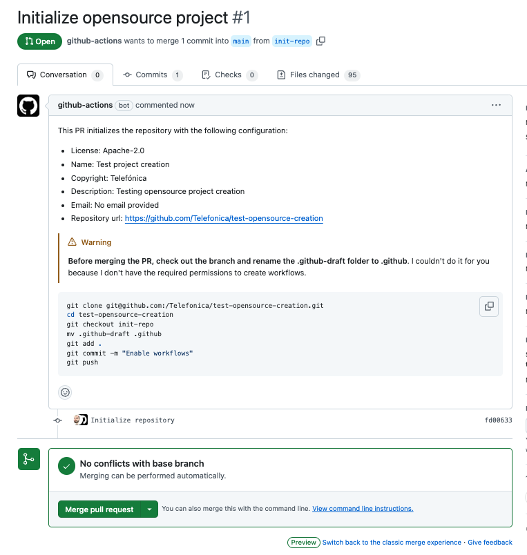
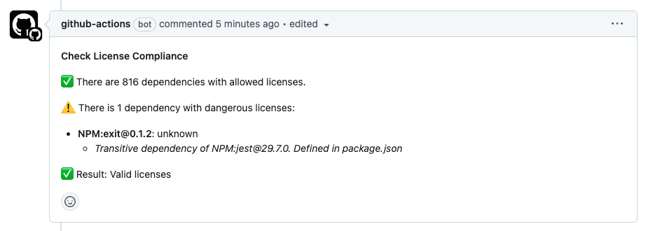

# Open Source Scaffold

## Description

This repository contains a set of tools for creating and checking the licensing and standard practices for open source projects.

In detail, it includes:

* A __CLI for scaffolding open source projects__ with the standard files, including workflows for license compliance and integrity checks, community guidelines, and more. Read the [CLI section](#nodejs-cli) below for more information.
* A __Github workflow__ automating the process of initializing a project with the standard files, by simply creating a new repository from this template and running the workflow. Read the [Repository template section](#repository-template) below for more information.
* A __Github action__ enabling to check the scaffolding of open source projects, ensuring that some relevant files are not removed after project creation. Read the [Github action section](#github-action-for-checking-the-opensource-resources) below for more information.

## Table of Contents

* [Preface](#preface)
  * [Supported licenses](#supported-licenses)
* [Usage](#usage)
  * [Repository template](#repository-template)
  * [Node.js CLI](#nodejs-cli)
  * [Github Action](#github-action-for-checking-the-opensource-resources)
* [The scaffold](#the-scaffold)
* [Inputs](#inputs)
* [Automatic Contributing License Agreement](#automatic-contributing-license-agreement)
* [License Integrity check](#license-integrity-check)
* [License Compliance check](#license-compliance-check)
* [Next steps](#next-steps)
* [Configuring the repository](#configuring-the-repository)

## Preface

Before creating a new open source project, you should read the [Practical Guide to Open Source Software at Telefónica](https://telefonicacorp.sharepoint.com/:w:/s/PatentOffice.TMEHI/EV1Yvq2kUhhCgy5FG-lryaYBWLwIRewSMZXsbZJeQ5uhlg?e=Mdrdwh&wdLOR=cCBDCEA92-4CAC-CF4A-BF60-44FC3F909578).

> [!WARNING]
> The tools in this repository are not a replacement for that document, they are just a set of tools to help you follow the guidelines in that document.

### Supported licenses

This scaffold is able to create projects with the following licenses:

* [Apache-2.0](https://spdx.org/licenses/Apache-2.0.html)
* [AGPL-3.0-only](https://spdx.org/licenses/GPL-3.0-only.html)
* [AGPL-3.0-or-later](https://spdx.org/licenses/GPL-3.0-or-later.html)
* [MPL-2.0](https://spdx.org/licenses/MPL-2.0.html)
* [MIT](https://spdx.org/licenses/MIT.html)

## Usage

### Repository template

You can initialize a new open source project by creating a new repository from this template. Follow these steps:

1. __Create a new repository__: Click on the "Use this template" button in Github when creating a new repository, and select this template.
2. __Run the "Initialize repository" workflow__: After creating the repository, go to the "Actions" tab and run the "Initialize repository" workflow. Enter the required [inputs](#inputs) and run the workflow. This will open a PR creating the initial files for your project, and removing the files from this template that are not needed in your project.
  
3. __Rename the `.github-draft` folder__: The PR creates a `.github-draft` branch that needs to be renamed to `.github` manually before merging it. Follow the instructions in the PR description to rename the folder and push the changes. _(This is because creating workflow files from an action requires special permissions, and the process of granting them would be more complex than simply renaming the folder)._
  
4. __Sign the CLA__: If you have not signed the CLA yet, you will need to do so. The PR will include a comment asking you to sign the CLA. Follow the instructions in the comment to sign the CLA.
5. __Merge the PR__

That's it! You can now start working on your project. Happy coding! 🚀

> [!IMPORTANT]
> Read the [Next steps](#next-steps) section for further info about the following steps to take after initializing the repository.

### Node.js CLI

This repository also includes a Node.js CLI that can be used to __create or update__ an open source project with the standard files.

To use it, follow these steps:

1. __Login to NPM__: Make sure you are logged in to the _@tid-xcut_ NPM registry. Follow the [instructions in this link](https://confluence.tid.es/display/CTO/%5BCross%5D+NPM+Packages).
2. __Run the CLI__: Run the following command

```bash
npx @tid-xcut/opensource-scaffold create
```

The CLI will prompt you for the required inputs to create the project, and also will ask you for confirmation before overwriting existing files.

> [!TIP]
> You can also use arguments to provide the required information without being prompted. Read the [inputs](#inputs) section for more information, or run `npx @tid-xcut/opensource-scaffold create --help`.

Once the files are created, you are ready to commit and push the changes to your repository. Happy coding! 🚀

> [!IMPORTANT]
> Read the [Next steps](#next-steps) section for further info about the following steps to take after initializing the repository.

### Github Action for checking the open source resources

This repository includes a Github Action that checks that the project contains the files that this scaffolding includes. It can be executed in PRs and pushes, ensuring that the project always remains compliant with the open source guidelines.

> [!TIP]
> This action is automatically added when using the scaffolding tools. So, usually you won't need to add it manually. But in case you need to do so, here you have an example:

```yaml
name: Open Source checks
on:
  pull_request:
  push:
    branches:
      - main
jobs:
  check-opensource-scaffold:
    name: Check Open Source Scaffold
    runs-on: ubuntu-latest

    steps:
      - name: Checkout
        id: checkout
        uses: actions/checkout@v4

      - name: Run check
        uses: Telefonica/opensource-scaffold@v1
```

## The scaffold

Once you initialize an open source project using this scaffold, it will include the following:

* __Readme file__:
  * Title, description, and table of contents of the project.
  * Link to the Contributing Guidelines
  * Link to the License file, and to the chosen license FAQ website.
* __License file__: The license file of the project, depending on the license selected for the project.
* __Code of conduct__: The code of conduct of the project. By default, it is the Contributor Covenant published at [contributor-covenant.org](https://www.contributor-covenant.org/).
* __Contributing guidelines__: The contributing guidelines of the project. It includes:
  * A link to the License file.
  * Instructions to fill the license headers that must be included in new files. Based on the [instructions of the Software Package Data Exchange (SPDX) website](https://spdx.dev/)
  * A link to the Code of Conduct.
  * A human-readable summary of the Contributor License Agreement, and links to the full CLA.
* __Contributor license agreement__: The Contributor License Agreement of the project.
  * It is based on the [CLA of HashiCorp](https://cla.hashicorp.com/).
* __Pull Request template__: The pull request template of the project. It includes:
  * A template for the title and description of the pull request.
  * A checklist to ensure that the contributor has read and understood the CONTRIBUTING and CODE_OF_CONDUCT documents, and that the contributor accepts the storage of their Github user name for the purpose of future reference.
  * A reminder to sign the CLA through a comment in the PR.
* __Issue templates__: Templates for bug reports and feature requests. The user is enforced to use one of the provided templates. Creating new issues without using a template is not allowed. The templates are:
  * __Bug report__: A template for bug reports.
    * Includes a check to ensure that the contributor has read the Code of Conduct.
  * __Feature request__: A template for feature requests.
    * Includes a check to ensure that the contributor has read the Code of Conduct.
* __A Github Workflow with open source checks__: It is executed on every pull request and pushes to the main branch, and checks the following:
    * [__License Integrity check__](#license-integrity-check): Checks that all files in the project are rightly licensed. That is, it checks that all files have the expected license header according to the license chosen for the project and a given configuration.
    * [__License compliance check__](#license-compliance-check): Checks that the dependencies of the project are licensed under a license that is compatible with a given configuration. The configuration by default is the one defined in the [Practical Guide to Open Source Software at Telefónica](#preface), but can be customized.
    * [__Open source resources check__](#opensource-resources-check): Checks that the project still contains the files that have been created by this scaffold, ensuring that the project always remains compliant with the open source guidelines.
* [__A Github Workflow for automatic CLA signing__](#automatic-contributing-license-agreement): It automates the process of signing the CLA, by creating a comment in the pull request asking contributors who have not signed CLA to sign. It fails the pull request status check with a failure if the contributor has not signed the CLA.
* __Changelog file__: A changelog file to keep track of the changes in the project. It is based on the [Keep a Changelog](https://keepachangelog.com/en/1.0.0/) format.

## Inputs

The [CLI](#nodejs-cli) and the [initialize workflow](#repository-template) support the following inputs.

> [!TIP]
> The CLI will prompt you for the required inputs when they are not provided as arguments.

| Name | Description | Type | Required | Default | CLI | Workflow |
| --- | --- | --- | --- | --- | --- | --- |
| `license` | The license to use for the project. | One of the [SPDX supported license ids](#supported-licenses) | Yes | - | `--license` | `license` |
| `name` | The name of the project. | String | Yes | - | `--name` | `name` |
| `copyright` | The copyright holder of the project. | String | Yes | - | `--copyright` | `copyright` |
| `description` | Project description | String | No | - | `--description` | `description` |
| `email` | The email of the project's community leader | String | No | - | `--email` | `email` |
| `log` | The log level to use when creating the scaffold | String | No | `info` | `--log` | Not supported. Always set to `debug` |
| `repo` | The repository URL of the project. | String | No | - | `--repo` | Not supported. Automatically set. |
| `overwrite` | Whether to overwrite existing files or not. When enabled, the CLI won't prompt for the files to overwrite | Boolean | No | - | `--overwrite` | Not supported. Automatically set to `true` |
| `no-prompts` | Whether to skip the prompts or not. When provided, the CLI won't prompt for any input | Boolean | No | - | `--no-prompts` | Not supported. Automatically set to `true` |

## Automatic Contributing License Agreement

The Contributor License Agreement (CLA) is a legal document that defines the terms under which a contributor is allowed to contribute to the project. It is a common practice in open source projects to ensure that the project owner has the necessary rights to distribute the contributions.

This scaffold includes a workflow that automates the process of signing the CLA. The workflow uses the [lite version](https://github.com/contributor-assistant/github-action) of the [CLA Assistant](https://github.com/cla-assistant/cla-assistant) tool, which is a free service that integrates with Github to manage the CLA process.

In this case, the signing of the CLA is done through a comment in the pull request. CLA workflow creates a comment on Pull Request asking contributors who have not signed CLA to sign and also fails the pull request status check with a failure. The contributors are requested to sign the CLA within the pull request by copy and pasting "I have read the CLA Document and I hereby sign the CLA" as a Pull Request comment like below. If the contributor has already signed the CLA, then the PR status will pass with success.

> [!WARNING]
> The data of the contributors signing the CLA is stored in a repository branch named `chore/cla-signatures`. It is created automatically when using the [template and the Initialize Repository Workflow](#repository-template). If you have used the [CLI](#nodejs-cli), you should create the branch manually and push it to the repository.


## License Integrity check

The scaffold includes a job in the "Open Source Checks" workflow that checks that all files in the project are rightly licensed.

This job uses the [Telefonica/check-spdx-headers action](https://github.com/Telefonica/check-spdx-headers) to check the SPDX headers in the project. The configuration of the action is defined in the `.github/check-spdx-headers.config.yml` file. It is filled automatically with the [inputs](#inputs) provided when creating the scaffold, but it can be also customized manually to fit better your project's needs.


## License Compliance check

We want to ensure that the software we build is in compliance with our [licensing guidance](https://telefonicacorp.sharepoint.com/:w:/s/PatentOffice.TMEHI/EV1Yvq2kUhhCgy5FG-lryaYBWLwIRewSMZXsbZJeQ5uhlg?e=Mdrdwh&wdLOR=cCBDCEA92-4CAC-CF4A-BF60-44FC3F909578).

This means that we are not incorporating third party software in the project under a license that is not compatible with the license selected for the overall project, or that is not compatible with the company's open source licensing guidelines.

For such purpose, this scaffold includes a job in the "Open Source Checks" workflow. This job uses the [Telefonica/check-license-compliance github action](https://github.com/Telefonica/check-license-compliance). The configuration of the action is defined in the `.github/check-license-compliance.config.yml` file. It is filled automatically with the [inputs](#inputs) provided when creating the scaffold, but it can be also customized manually to fit better your project's needs.

> [!WARNING]
> The check is language dependent, and, for the moment, it only supports Node.js dependencies. You should comment it out if your project is not a Node.js project, and read the suggestions below to implement you or own check depending on the language of your project.

Please review the [licensing guidance](https://telefonicacorp.sharepoint.com/:w:/s/PatentOffice.TMEHI/EV1Yvq2kUhhCgy5FG-lryaYBWLwIRewSMZXsbZJeQ5uhlg?e=Mdrdwh&wdLOR=cCBDCEA92-4CAC-CF4A-BF60-44FC3F909578) when configuring the license compliance check. In case of doubt, please contact the Intellectual Property team, to the email address indicated in such document.



> [!TIP]
> In repositories with [GitHub Advanced Security enabled](https://docs.github.com/en/get-started/learning-about-github/about-github-advanced-security), you may use the [Github's dependency-review-action](https://github.com/actions/dependency-review-action) instead of the [Telefonica/check-license-compliance github action](https://github.com/Telefonica/check-license-compliance). In such case, modify the `.github/workflows/open-source-checks.yml` to change the action used in the `check-license-compliance` job.

### Checking other languages than Node.js

As mentioned above, the [Telefonica/check-license-compliance github action](https://github.com/Telefonica/check-license-compliance) for the moment only supports Node.js dependencies. If your project is not a Node.js project, you should comment it out and implement your own check depending on the language of your project.

Here you have some suggestions about how to implement the check for some common languages until they are supported by our Github action:

<details>
  <summary>See code snippets</summary>

### Java

Run this to get the dependency license list.

```bash
mvn org.codehaus.mojo:license-maven-plugin:aggregate-third-party-report
```

When this is done, the result will be in ./target/site/aggregate-third-party-report.html.

### Python

```bash
pip3 install --user pylic
cd path/to/repo
touch pyproject.toml
pylic check
```

### Go

```bash
go install github.com/google/go-licenses@latest
go-licenses check . --allowed_licenses=MIT,ISC,BSD-3-Clause,Apache-2.0,BSD-2-Clause,0BSD,CC-BY-4.0
```

### PHP

```bash
composer require dominikb/composer-license-checker
composer exec composer-license-checker -- check
```

> [!INFO]
> These snippets are from the [eBay's open source program docs](https://opensource.ebay.com/contributing/approval/tooling/). Check the original source for more information.

</details>

## Next steps

Once you have used the scaffolding tools to create the resources, you should follow these steps to finalize the setup of your project:

1. __Ensure that the `chore/cla-signatures` branch exists__: If you have used the [CLI](#nodejs-cli), you should create the `chore/cla-signatures` branch manually and push it to the repository. This branch is used to store the data of the contributors signing the CLA. Read the [Automatic Contributing License Agreement](#automatic-contributing-license-agreement) section for more information.
2. __Remember to configure the repository rules__: Remember to configure the branch protection rules to require the different checks in PRs, including the CLA signing check and the open source resources checks. Read the [Configuring the repository section](#configuring-the-repository) for more information.
3. __Configure the License integrity check__: The scaffold creates a basic configuration for the license integrity check, but you should review it and adapt it to your project. Read the [License Integrity check](#license-integrity-check) section for more information.
4. __Configure the License compliance check__: The repository creates a basic configuration for the license compliance check, but you should review it and adapt it to your project. Read the [License Compliance check](#license-compliance-check) section for more information.
    * Remember to modify the `.github/workflows/open-source-checks.yml` file to install the dependencies needed to run the check for your project's language in the `check-license-compliance` job. _(You'll find a TODO comment in the file indicating where to do it.)_
    * If your project is not a Node.js project, you should comment out the `check-license-compliance` job in the `.github/workflows/open-source-checks.yml` file and implement your own check depending on the language of your project.
5. __Finish the README file__: The scaffold creates for you a `README.md` file with some basic information about the project and license, but you should fill it with the information about the project, how to install it, how to use it, etc. But remember to __always keep the "Contributing" and "License" sections__.
6. __Finish the CONTRIBUTING file__: You should do the same with the `CONTRIBUTING.md` file. You should __fill the "Getting Started" section__ with the steps that a contributor should follow to start contributing to the project, and __add as many sections as needed to explain the contribution process__. But you should __always keep the rest of sections__ about the licensing of new files, code of conduct and the CLA.

> [!IMPORTANT]
> Once the repository is ready, ask to your manager to contact with the legal department to review the project and approve the publication before making it public.

## Configuring the repository

As the scaffold creates Github workflows, you should configure the repository rules to require the different checks in PRs, etc.

You can use the rules json files mentioned in the next steps to create the rules easily by using the "Import a ruleset" button in the "Rulesets" tab of the repository settings.


You should configure at least next repository rules:

### Protect the `chore/cla-signatures` branch

It should be protected to avoid accidental deletion. Note also that the CLA bot will commit to this branch, so it should be allowed to do so.


> [!TIP]
> You have a template for this rule in the [`docs/repo-rule-cla-signatures.json`](docs/repo-rule-cla-signatures.json) file.

### Protect the `main` branch

The main branch should be protected by requiring status checks to pass before merging, including the CLA signing check and the Open Source resources checks.


> [!TIP]
> You have a template for this rule in the [`docs/repo-rule-main.json`](docs/repo-rule-main.json) file.

### Final notes

> [!TIP]
> Remember also to provide a good description and topics for the repository in order to make it easier for others to find, use, and hopefully contribute to your project. 😉
