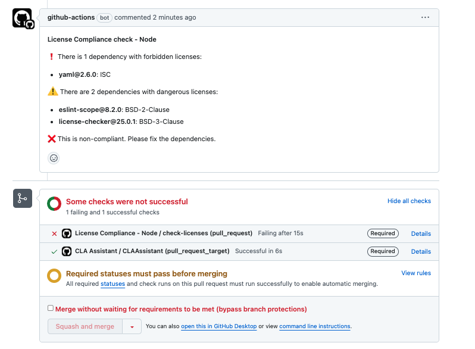

# License Compliance check - Node.js

This tool is used to check the license compliance of the Node.js dependencies in a project.

## Overview

This tiny module, in conjunction with the workflow int the `.github/workflows/license-compliance-node.yml` file, checks the licenses of the Node.js dependencies in a project.

It adds a small layer to the [`license-checker` library](https://github.com/davglass/license-checker), providing:

* Enables to define allowed, forbidden, and warning licenses in a configuration file.
* Enables to define any other [option that the `license-checker` library supports](https://github.com/davglass/license-checker#options), for each different type of check (forbidden or warning). This makes it very customizable.
* Runs the check in a GitHub Actions workflow.
* Posts a comment in the pull request with the results of the check.
* Sets the status of the check in the pull request according to the configuration.

## Installation

For the moment, it is not distributed as a package, so you need to keep this folder in your project and the next files:
  * `package.json`
  * `package-lock.json`
  * `license-compliance-node.config.yaml`
  * `.github/workflows/license-compliance-node.yml`

## Configuration

The configuration is defined in the `license-compliance-node.config.yaml` file. It has the following structure:

* `licenses`: Object containing details about the licenses that are allowed, forbidden, or should produce a warning. Licenses are identified by their [SPDX identifier](https://spdx.org/licenses/).
  * `allowed`: Array of strings with the allowed licenses.
  * `forbidden`: Array of strings with the forbidden licenses.
  * `warning`: Array of strings with the licenses that should produce a warning.
* `errorOnForbidden`: Boolean indicating if the check should fail when a forbidden license is found.
* `errorOnWarning`: Boolean indicating if the check should fail when a warning license is found.
* `licenseCheckerOptions`: Object with the options that are passed to the `license-checker` library on each different type of check. You can find the available options [here](https://github.com/davglass/license-checker#options).
  * `global`: Object with the global options. These options are applied both when checking "warning" and "forbidden" licenses.
  * `warning`: Object with the options that are applied when checking "warning" licenses. They are merged with the global options.
  * `forbidden`: Object with the options that are applied when checking "forbidden" licenses. They are merged with the global options.
